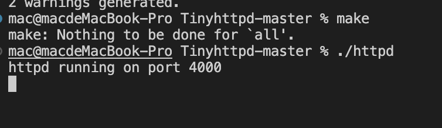

# TinyHttp【中文注解版】

必须推荐的C语言初学者很好的入门项目，镜像Fork自[sourceForge](https://sourceforge.net/projects/tiny-httpd/)，代码细节请看源码注释

## 简介

TinyHttp是原作者J. David Blackstone在1999年为了完成课堂作业写的一个最简webserver，实现了页面的浏览和CGI的功能。

为了方便C语言初学者理解和学习，我对源代码`httpd.c`进行中文注解未变动代码细节，对 `simpleclient.c`文件增加 `request_write`和`response_read`两个函数模拟`http get`请求

## 环境配置

**环境1**:安装C语言开发和调试环境(如已经安装了就不用了），参考链接 https://zhuanlan.zhihu.com/p/571934657?utm_id=0

**环境2**: 安装 perl (mac和Ubuntu默认已装)可以在终端输入`which perl`判断perl是否已经安装，如果提示类似 `usr/bin/perl`表示安装成功


**环境3**: 安装 perl-cgi，命令行执行`perl -MCPAN -e shell`等待安装成功后，显示`cpan[1]>`后执行 `install CGI.pm`继续等待安装完成后，执行 `perl -MCGI -e 'print "CGI.pm version $CGI::VERSION\n";'`验证是否安装成功，出现 `CGI.pm version 4.48`信息，说明安装成功


## 踩坑点

**坑点1**

打开 `check.cgi`和`color.cgi`文件，看下第一行的 `#!/usr/bin/perl -Tw`路径是否和上面自己的安装的perl路径一致;

**坑点2**

修改 `check.cgi`和`color.cgi`文件权限为可执行权限

```sh
chmod a+x check.cgi
chmod a+x color.cgi
```


## 代码中关键函数的理解

`get_line`函数：先理解**http数据包的格式**，代码中按照 `\r\n`为分隔符每次读取一行


【请求行】完整的格式为（代码中关于请求行的拆解字符串的处理，参考下面的格式）

`GET /user?id=1&country=china HTTP/1.1`


`execute_cgi`函数 中关于管道逻辑的图解


## 效果展示

1. `make`编译代码

2. `./httpd`启动服务

   

3. 浏览器输入 `http://127.0.0.1:4000`

   

4. 输入颜色 `red`点击 提交

   

---

**作者的介绍**

  This software is copyright 1999 by J. David Blackstone.  Permission
is granted to redistribute and modify this software under the terms of
the GNU General Public License, available at http://www.gnu.org/ .

  If you use this software or examine the code, I would appreciate
knowing and would be overjoyed to hear about it at
jdavidb@sourceforge.net .

  This software is not production quality.  It comes with no warranty
of any kind, not even an implied warranty of fitness for a particular
purpose.  I am not responsible for the damage that will likely result
if you use this software on your computer system.

  I wrote this webserver for an assignment in my networking class in
1999.  We were told that at a bare minimum the server had to serve
pages, and told that we would get extra credit for doing "extras."
Perl had introduced me to a whole lot of UNIX functionality (I learned
sockets and fork from Perl!), and O'Reilly's lion book on UNIX system
calls plus O'Reilly's books on CGI and writing web clients in Perl got
me thinking and I realized I could make my webserver support CGI with
little trouble.

  Now, if you're a member of the Apache core group, you might not be
impressed.  But my professor was blown over.  Try the color.cgi sample
script and type in "chartreuse."  Made me seem smarter than I am, at
any rate. :)

  Apache it's not.  But I do hope that this program is a good
educational tool for those interested in http/socket programming, as
well as UNIX system calls.  (There's some textbook uses of pipes,
environment variables, forks, and so on.)

  One last thing: if you look at my webserver or (are you out of
mind?!?) use it, I would just be overjoyed to hear about it.  Please
email me.  I probably won't really be releasing major updates, but if
I help you learn something, I'd love to know!

  Happy hacking!

                                   J. David Blackstone

